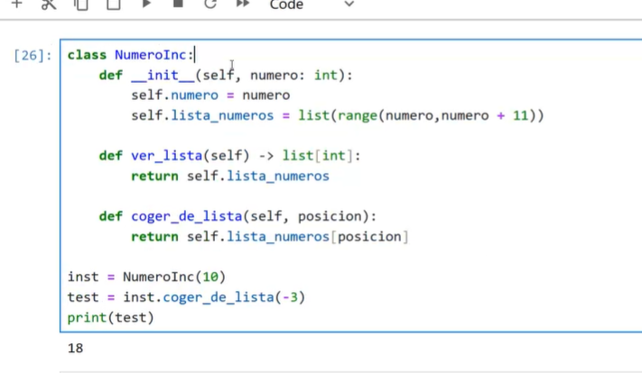

python -m venv .env
.\.env\Scripts\activate
python.exe .\dado.py

Test

Validador de contraseña (funcion)
Base datos con usuario y contraseña (validar esa contraseña)
Conversor de romano a decimal

"""
crea el entorno virtual
python -m venv <nombre-venv>
<nombre-venv>/Scripts/activate
una vez dentro, isntalla pytest
pip install pytest
se invoca pytest con
pytest <nombre-script>

"""