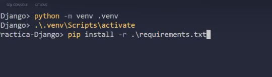
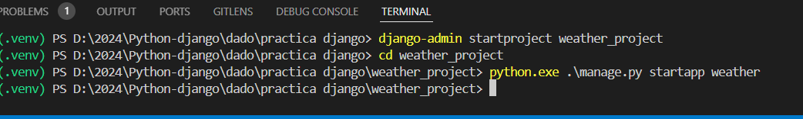

# Entorno virtual
- python -m venv .venv

- .\.venv\Scripts\activate

- Instalamos los paquetes:  pip install -r .\requirements.txt

# Iniciado Projecto

- django-admin startproject weather_project
- cd .\weather_project\

# creamos una app dentro de la carpeta ya creada
- pyhton.exe .\manage.py startapp weather
  

